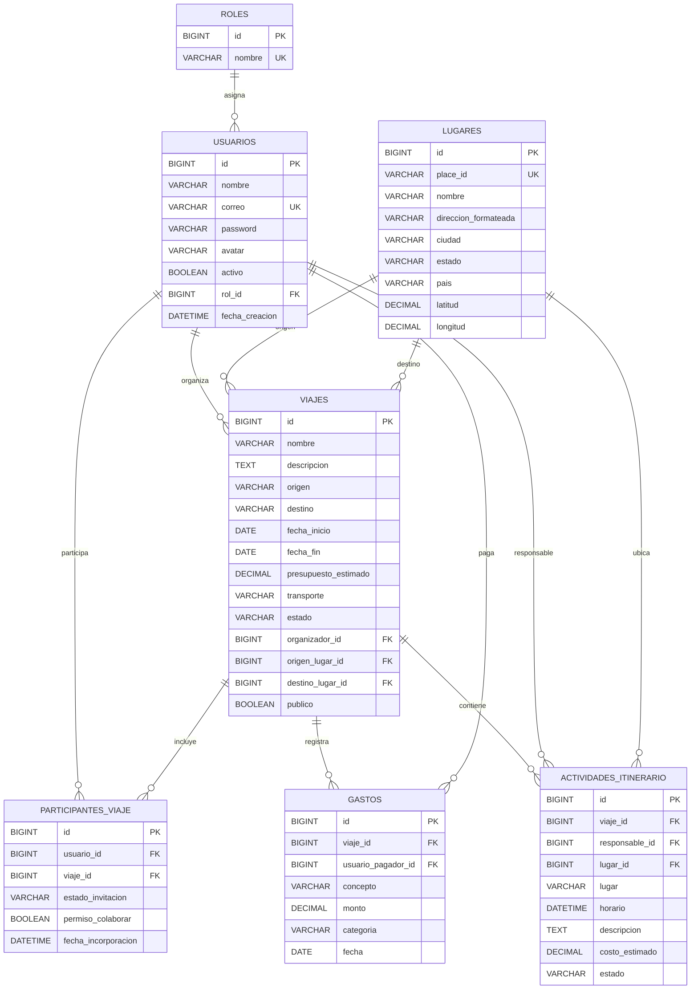

# RuteApp

RuteApp es una aplicación web para organizar viajes en grupo de manera colaborativa. Su propósito es reunir en un solo lugar la información que normalmente queda dispersa en mensajes, notas y hojas de cálculo.

La plataforma permite administrar viajes, participantes, itinerarios y gastos. También maneja distintos niveles de acceso para proteger la información y limitar las acciones disponibles según el rol de cada usuario.

## Integrantes

- Miguel Ángel Hernández Pérez
- Yareli Yazmin Pacheco Aragón

## Enlaces del proyecto

- Aplicación desplegada: [https://ruteapp.online/](https://ruteapp.online/)
- Inicio de sesión: [https://ruteapp.online/login](https://ruteapp.online/login)
- URL base de la API: `https://ruteapp.online/api`
- Repositorio público: [https://github.com/Angixs-zz/RuteApp](https://github.com/Angixs-zz/RuteApp)
- Tablero de GitHub Projects: [RuteApp Project](https://github.com/users/Angixs-zz/projects/2)
- Prototipo navegable en Figma: [RuteApp - Rutea](https://www.figma.com/proto/W92uzre6lrvqZPdYmZ8xlS/Rutea?node-id=0-1&t=UzlG9mf9mJFVFSPl-1)
- Panel de la integración Geoapify: [https://myprojects.geoapify.com/](https://myprojects.geoapify.com/)

> El panel de Geoapify se utiliza para administrar la integración de lugares, pero no corresponde a la URL base de la API de RuteApp.

## Funciones principales

- Registro e inicio de sesión mediante correo electrónico y contraseña.
- Autenticación con JSON Web Token (JWT).
- Control de acceso mediante roles.
- Creación y administración de viajes.
- Búsqueda de lugares con Geoapify.
- Administración de participantes e invitaciones.
- Registro de actividades para el itinerario.
- Registro y consulta de gastos de cada viaje.
- Búsqueda y paginación de viajes desde el servidor.
- Validación de datos en el frontend y el backend.

## Roles de usuario

El sistema cuenta actualmente con tres roles:

- **Administrador:** administra usuarios y roles y tiene acceso general al sistema.
- **Usuario:** crea viajes personales y participa en viajes compartidos.
- **Agencia:** organiza viajes y administra la información relacionada con ellos.

## Credenciales de prueba

Las siguientes cuentas se crean mediante la migración de datos de prueba. Estas credenciales son únicamente para la evaluación del proyecto.

| Rol | Correo | Contraseña |
| --- | --- | --- |
| Administrador | `admin@ruteapp.com` | `Prueba123!` |
| Usuario | `usuario1@ruteapp.com` | `Prueba123!` |
| Agencia | `agencia1@ruteapp.com` | `Prueba123!` |

Las contraseñas no se almacenan en texto plano en la base de datos. Los datos de prueba contienen hashes generados con BCrypt.

## Tecnologías utilizadas

### Backend

- Java 21
- Spring Boot 4.1
- Spring Web MVC
- Spring Data JPA y Hibernate
- Spring Security
- JWT
- Bean Validation
- Flyway
- MySQL
- Maven

### Frontend

- React 19
- React Router
- Axios
- Vite
- CSS responsivo

### Herramientas e integraciones

- Git y GitHub
- GitHub Projects
- Bruno
- Figma
- Geoapify
- Nginx
- Let's Encrypt

## Arquitectura general

El backend sigue una separación por responsabilidades:

```text
Controller -> Service -> Repository -> MySQL
```

Los controladores reciben y validan DTOs de entrada. Los servicios contienen la lógica de negocio y utilizan repositorios de Spring Data para acceder a la base de datos. Las respuestas de la API se entregan mediante DTOs para evitar exponer directamente las entidades JPA.

El frontend consume la API con Axios. Un interceptor agrega automáticamente el token JWT al encabezado `Authorization` de las peticiones protegidas.

## Diagrama Entidad-Relación

La relación entre usuarios y viajes es de muchos a muchos y se resuelve mediante la tabla intermedia `participantes_viaje`. Esta tabla también almacena el estado de la invitación y el permiso de colaboración.



## Diseño visual

El diseño utiliza verde azulado como color principal porque se relaciona con tranquilidad, confianza y exploración. El coral y el dorado se emplean como colores de acento para destacar acciones y aportar energía visual. Los fondos claros y los tonos neutros ayudan a mantener la lectura sencilla y ordenada.

La interfaz se diseñó para adaptarse a pantallas de escritorio y dispositivos móviles, conservando una apariencia consistente con el prototipo de Figma.

## Requisitos para ejecución local

- Java 21
- MySQL 8
- Node.js y npm
- Git

## Configuración del backend

1. Clonar el repositorio.

```bash
git clone https://github.com/Angixs-zz/RuteApp.git
cd RuteApp
```

2. Crear en MySQL una base de datos llamada `ruteapp_db`.

```sql
CREATE DATABASE ruteapp_db CHARACTER SET utf8mb4 COLLATE utf8mb4_unicode_ci;
```

3. Copiar el archivo de configuración de ejemplo.

```bash
cp backend/src/main/resources/application-example.properties backend/src/main/resources/application.properties
```

4. Completar `application.properties` con las credenciales locales de MySQL, una clave JWT segura y la llave de Geoapify. Este archivo está ignorado por Git y no debe subirse al repositorio.

Para habilitar los correos mediante Brevo, crea una clave SMTP en **SMTP & API > SMTP** y configura estas variables:

```bash
MAIL_HOST=smtp-relay.brevo.com
MAIL_PORT=587
MAIL_USERNAME=LOGIN_SMTP_MOSTRADO_POR_BREVO
MAIL_PASSWORD=CLAVE_SMTP_GENERADA_EN_BREVO
MAIL_SMTP_AUTH=true
MAIL_STARTTLS=true
MAIL_ENABLED=true
MAIL_FROM=REMITENTE_VERIFICADO_EN_BREVO
FRONTEND_URL=http://localhost:5173
```

`MAIL_USERNAME` debe ser el valor **SMTP login** mostrado por Brevo, que puede ser diferente del correo del perfil. `MAIL_FROM` debe estar registrado y verificado en **Senders & IP**. La clave SMTP es secreta y nunca debe agregarse a `application-example.properties` ni al repositorio.

Para habilitar mensajes de WhatsApp mediante el Sandbox de Twilio, configura:

```bash
TWILIO_ACCOUNT_SID=SID_DE_LA_CUENTA
TWILIO_AUTH_TOKEN=TOKEN_SECRETO
TWILIO_WHATSAPP_FROM=whatsapp:+14155238886
```

El SID y el token deben mantenerse fuera del repositorio. En el Sandbox, el destinatario debe haberse unido previamente con el código `join` asignado por Twilio. Los mensajes libres solo funcionan durante las 24 horas posteriores al último mensaje del usuario; fuera de esa ventana se requiere una plantilla aprobada.

5. Iniciar el backend desde su directorio.

```bash
cd backend
./mvnw spring-boot:run
```

El backend local queda disponible en `http://localhost:8080/api`. Flyway crea y actualiza la estructura de la base de datos al iniciar la aplicación.

## Configuración del frontend

En otra terminal, instalar exactamente las dependencias registradas en el archivo de bloqueo e iniciar Vite:

```bash
cd frontend
npm ci
npm run dev
```

El frontend local queda disponible en `http://localhost:5173`.

## Verificación del proyecto

### Backend

La base de datos MySQL debe estar disponible antes de ejecutar las pruebas.

```bash
cd backend
./mvnw test
```

### Frontend

```bash
cd frontend
npm run lint
npm run build
```

## Uso de la API

La mayoría de los endpoints requieren un JWT. El token obtenido en el login debe enviarse en cada petición protegida:

```http
Authorization: Bearer TOKEN_JWT
```

Ejemplo de inicio de sesión en producción:

```http
POST https://ruteapp.online/api/auth/login
Content-Type: application/json

{
  "correo": "admin@ruteapp.com",
  "password": "Prueba123!"
}
```

Algunas rutas principales son:

| Método | Ruta | Descripción |
| --- | --- | --- |
| POST | `/api/auth/login` | Iniciar sesión |
| POST | `/api/usuarios` | Registrar usuario |
| GET | `/api/viajes` | Consultar viajes con paginación y búsqueda |
| POST | `/api/viajes` | Crear un viaje |
| GET | `/api/participantes/viaje/{id}` | Consultar participantes de un viaje |
| GET | `/api/actividades/viaje/{id}` | Consultar el itinerario de un viaje |
| GET | `/api/gastos/viaje/{id}` | Consultar gastos de un viaje |
| GET | `/api/lugares/autocompletar` | Buscar sugerencias de lugares |
| POST | `/api/comunicaciones/whatsapp` | Enviar un mensaje por WhatsApp mediante Twilio |
| POST | `/api/participantes/{id}/notificar-whatsapp` | Enviar un recordatorio de viaje al participante |

## Pruebas con Bruno

La colección se encuentra en `bruno/RuteApp/`. Incluye peticiones para iniciar sesión, utilizar el token JWT, probar los módulos principales y comprobar respuestas de error intencionales.

La petición `Comunicaciones/Enviar WhatsApp.yml` requiere un JWT en la variable `token`, un teléfono real en formato internacional y las credenciales de Twilio configuradas en el backend.

El entorno local de Bruno utiliza como base `http://localhost:8080`. Los identificadores y tokens guardados en la colección son valores de prueba y pueden cambiar al reiniciar la base de datos.

## Seguridad

- Las contraseñas se almacenan mediante BCrypt.
- Los endpoints protegidos requieren autenticación JWT.
- Spring Security restringe operaciones según el rol autenticado.
- Los DTOs de entrada utilizan Bean Validation.
- Los errores se manejan en formato JSON mediante un manejador global.
- Las credenciales y llaves privadas se guardan en `application.properties`, archivo excluido del repositorio.
- `application-example.properties` muestra las variables necesarias sin incluir secretos reales.

## Estructura del repositorio

```text
RuteApp/
├── backend/           API REST desarrollada con Spring Boot
├── frontend/          Aplicación web desarrollada con React
├── bruno/RuteApp/     Colección de pruebas de la API
└── README.md          Documentación principal
```
